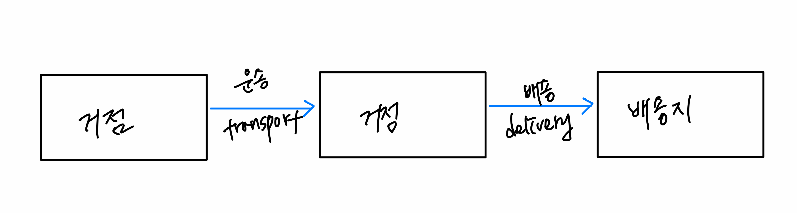

## 4.1 서비스란?
소프트웨어 개발에서 말하는 서비스는 클라이언트를 위해 무언가를 해주는 객체를 말한다.

도메인 주도 설계에서 말하는 서비스는 크게 **두가지**로 나뉜다.
- 도메인을 위한 서비스
- 애플리케이션을 위한 서비스 (6장에서 다룰 예정)

## 4.2 도메인 서비스란?
값 객체나, 엔티티 같은 도메인 객체에는 객체의 행동을 정의할 수 있다. 예를 들면, `User` 가 `Team` 을 바꾸는 **changeTeam** 이라는 행동을
Member 엔티티에 정의하는 것이다.

```java
import javax.annotation.processing.Generated;

public class User {
    @Id
    @Generated
    private Long id;
    private String name;
    
    @ManyToOne
    private Team team;
    
    // 팀 바꾸기
    public void changeTeam(Team team){
        this.team = team;
        team.addUser(this);
    }
}

```
그러나 위처럼 엔티티에 구현하기 어색한 행동도 있는데, 도메인 서비스는 이런 어색함을 
해결해주는 객체이다.

### 4.2.1 값객체나 엔티티에 정의하기 어색한 행동
_"사용자명에 중복을 허용하지 않는다"_ 는 도메인 규칙은 구체적으로 어떤 객체에 구현돼야 할까?

일단 확실한 것은 사용자에 대한 사항이니, 사용자를 나타나는 객체에 구현하는 것은 확실하다.
일단 User 클래스에 사용자명 중복을 체크하는 행위를 추가해보자.

```java
public class User {
    private Long id;
    private String username;

    // 사용자명 중복 체크
    public boolean isExists(User user) {
        User findUser = userRepository.find(user.getName());
        return findUser == null;
    }
}
```
```java
public static void main(String[]args){
    User newUser = new User();
    newUser.setName("치코리타");
    
    // 이름 중복 체크
    newUser.isExists(newUser); // 자기 자신에게 중복 여부를 묻고 있다. 뭔가 이상 🤔   
}
```

사용자명 중복을 확인하는 처리가 User 클래스에 돼어있으니, 결국 자기 자신에게 중복 여부를 물어보고 있다.

중복 여부 확인을 새로 생성한 객체에게 맡기면 개발자에게 혼란을 준다. 그러니, 사용자명 중복을 확인하는
목적으로만 사용되는 전용 인스턴스를 만들자!

### 4.2.2 부자연스러움을 해결해주는 객체
앞선 문제인 User 도메인(엔티티)에 구현하기 어색한 User 의 행동을 어디에 정의할 것인지 생각해 보았다.
User 엔티티에 정의하는 것은 혼란스러웠기에, 
User 의 이름 중복만을 확인하는 목적으로 User 전용 인스턴스를 만들어보자.

```java
public class UserService {
    // 사용자명 중복 체크
    public boolean isExists(User user) {
        User findUser = userRepository.findByUsername(user.getUsername());
        return findUser == null;
    }
}
```

```java
public static void main(String[]args){
    User newUser = new User();
    newUser.setName("치코리타");
    
    UserService userService = new UserService();
    // 도메인 서비스에 요청하기
    userService.isExists(newUser);
}
```
값 객체나, 엔티티에 정의하기 부자연스러운 처리를 도메인 서비스에 정의하면 자연스러운 코드 작성이 가능하다.

## 4.3 도메인 서비스를 남용한 결과
엔티티나, 값 객체에 정의하는게 더 자연스러운 처리를 도메인 서비스에 정의하는 것은 좋지 않다.
```java
// User 이름 변경
public class UserService {
    public void changeName(User user, String username) {
        user.setUsername(username);
    }
}
```
#### 도메인 서비스에 정의한 경우
- 도메인 서비스에 정의
```java
public static void main(String[]args){
    User newUser = new User();
    newUser.setName("치코리타");
    
    UserService userService = new UserService();
    
    // 유저 이름 변경
    userService.changeUsername("파이리", newUser);
}
```
#### 앤티티에 정의한 경우
- 엔티티에 정의
```java
public static void main(String[]args){
    User newUser = new User();
    newUser.setName("치코리타");
    
    // 유저 이름 변경
    newUser.changeName("파이리");
}
```
엔티티에 정의한 경우의 코드가 더 좋아보인다.
구체적인 이유는 다음과 같다.
- 모든 처리를 도메인 서비스에 구현하면 엔티티에는 게터와 세터만 남게 됨
  - 이는 User 객체의 처리 내용이나, 도메인 규칙을 발견하기 어렵게 함

> 생각없이 모든 처리를 도메인 서비스로 옮기면, 도메인 객체는 그저 데이터를 저장할 뿐, 별다른 정보를
> 제공할 수 없는 객체가 되는 결과를 낳는다. - 67p

이런 객체는 데이터와 행위를 함께 모아놓는다는 객체 지향 설계의 기본 원칙을 거스르게 된다.

근데 위 예제는 좀 잘못돼었다고 생각한다. 이름 변경을 위해서는 중복 체크 로직이 필요한데, 
이는 UserService 에 정의되어있으므로 도메인 서비스에 정의되는 게 맞다고 생각한다.

### 4.3.1 도메인 서비스는 가능한 한 피할 것
> 어떤 행위를 값 객체나 엔티티에 구현할지 아니면 도메인 서비스에 구현할지 망설여진다면 우선 엔티티나 값 객체에
> 정의하는 것이 좋으며, 도메인 서비스에 행위를 구현하는 것은 가능한 한 피해야 한다. - 68p

> 도메인 서비스를 남용하면 데이터와 행위가 단절돼 로직이 흩어지기 쉽다. 로직이 흩어지면 소프트웨어가 변경의 유연성이
> 저해된다.

## 4.5 물류 시스템의 도메인 서비스 예
사용자명 중복 확인 외의 다른 도메인 서비스의 예를 살펴보자.

물류시스템!

물류 시스템에서는 화물이 직접 배송지로 보내지는 것이 아니라, 현재 거점에서 거점을 거쳐 배송된다.


  이 물류 시스템을 두가지 방법으로 코드로 정의해보겠다.
  
**첫번째 방법,** 거점의 행동으로 정의하기
거점은 물류 도메인에서 중요한 개념으로, 엔티티 형태로 정의된다.
```java
class PhysicalDistributionBase {
    
    ...
    public Baggage ship(Baggage baggage) {
        ...
    }

    public void receive(Baggage baggage) {
        ...
    }
}

```
거점은 출고(ship) 와 입고(receive) 라는 행위를 갖는다. 실제 현장에서는 물리 법칙에 따라 출고와 입고가 확실히
함께 일어나지만, 프로그램에서는 그렇지 않다. 그러므로 **출고와 입고가 빠집없이 함께 일어나도록 '운송' 처리를 갖춰야 한다.**
```java
class PhysicalDistributionBase {
    ...
    public void transport(PhysicalDistributionBase to, Baggage baggage) {
        Baggage shippedBaggage = ship(baggage);
        to.receive(shippedBaggage);
    }
    // 운송 기록도 필요
}
```
transport 메서드를 이용하는 한, 출고와 입고는 함께 이루어짐. 그러나 거점➡️거점으로 직접 화물이 이동하는 건 
뭔가 이상하다. 또한 운성 기록 같은 처리도 해야하는데, 이들 처리를 모두 거점 객체가 수행해댜 한다면
어딘가 어색하면서도 다루기 어려울  것읻.

**두번째 방법** 운송 도메인 서비스 정의하기
운송이라는 행위는 아무래도 특정 객체의 행위로 정의하기에는 어려움이 있다. 거점 대신 운송을 맡을 별도의 
도메인 서비를 정의해보자.

```java
class TransportService {
    public void transport(PhysicalDistributionBase from,PhysicalDistributionBase to, Baggage baggage) {
        Baggage shippedBaggage = from.ship(baggage);
        to.receive(shippedBaggage);
        
        // 운송 기록 남기기
    }
}
```
어떤 처리를 객체 안에 정의했을 때 잘 들어맞지 않는 느낌이 든다면, 이 처리를 도메인 서비스로 옮기면 자연스럽게
나타낼 수 있다.

