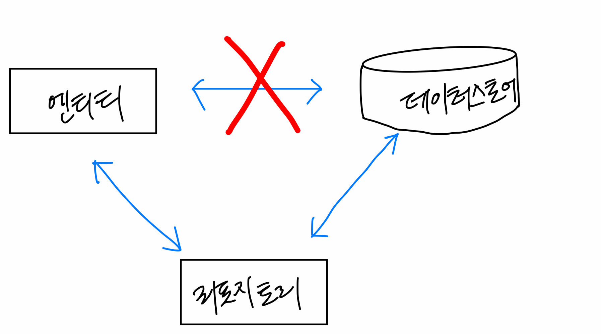
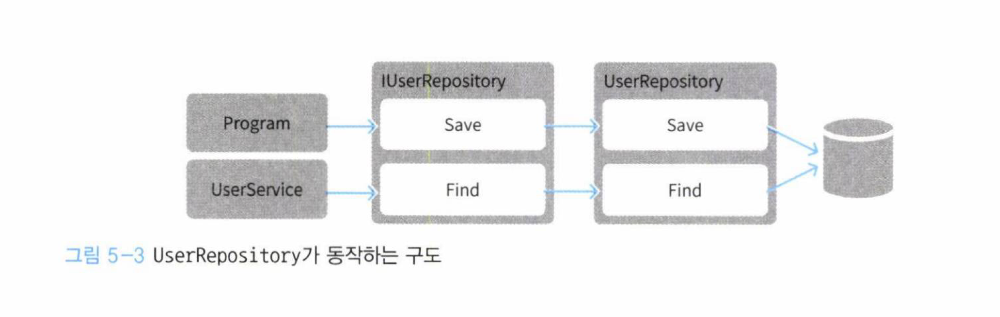

## 5.1 리포지토리란 무엇인가
> 리포지토리란 데이터를 저장하고 복원하는 처리를 추상화하는 객체이다.

데이터 스토어에 직접 객체를 저장하는 것 대신, 리포지토리에게 객체의 저장, 수정 등을 맡김.



## 5.2 리포지토리의 책임
> 리포지토리의 책임은 도메인 객체를 저장하고 복원하는 퍼시스턴시다.

퍼시스턴시를 구현하는 코드는 특정 데이터 스토어를 사용하기 위한 구체적인 절차를 따라야 하는데, 이 절차를
도메인 코드에 노출시키면 아주 지저분한 코드가 탄생한다.

```java
public void createUser(User user) {
    UserService userService = new UserService();
    if (userService.isExists(user)) {
        throw new RuntimeException("이미 존재하는 사용자명");    
    }
    // 연결시도    
    try {
        conn = DriverManager.getConnection(...)    
    } catch(SQLException e) {
        ...    
    }finally { // 연결해제
        ...
    }
    
    
}
```

사용자 중복확인을 맡은 코드이지만, 후반부에 DB 에 접근하는 코드가 매우 지저분하게 있는 것이 보인다.
코드의 대부분이 DB 처리 코드로 차있기에, 중요한 비즈니스 로직을 파악하기 어렵다. 데이터스토어를 직접 다루는 퍼시스턴스 관련 코드를 추상적으로 뽑아내보자.

```java
class App {
    private UserRepository userRepository;
    
    public void createUser(User user) {
        UserService userService = new UserService();
        if (userService.isExists(user)) {
            throw new RuntimeException("이미 존재하는 사용자명");
        }
        userRepository.save(user);
    }
}
```
데이터스토어에 대한 명령을 추상화함으로써 데이터스토어를 직접 다루는 코드를 숨겼다. 따라서 사용자 생성과 관련된 순수한 로직만 남아 코드가 의도하는
바를 잘 나타내게 되었다.

## 5.3 리포지토리의 인터페이스
```java
public interface IUserRepository {
    void save(User user);
    User find(String username);
}
```

## 5.4 리포지토리 구현하기
위에서 선언한 인터페이스를 구현해보자.
```java
public class UserRepository implements IUserRepository {
    public void save(User user) {
        conn = DriverManager.getConnection(...);
    }
}
```

