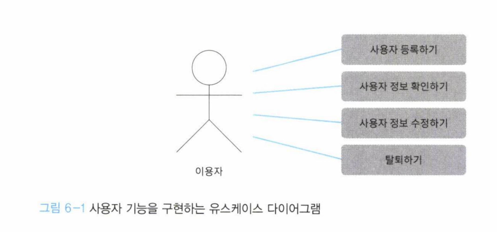

## 6.1 애플리케이션 서비스란 무엇인가
앞서 서비스에는 두가지가 있었다.
- 도메인 서비스
- 애플리케이션 서비스

> 애플리케이션 서비스를 한마디로 표현하면 유스케이스를 구현하는 
> 객체라고 할 수 있다

## 6.2 유스케이스 수립하기

## 정리
> 도메인 모델을 표현하는 것만으로 애플리케이션이 완성되지 않는다. 애플리케이션 
> 서비스는 도메인 객체를 다루는 데 전념하며 **유스케이스를 구현한다**

> 애플리케이션 서비스를 구현할 때는 도메인 규칙에 대한 기술이 포함되지 않게
> 주의해야 한다. 애플리케이션 서비스에 도메인 지식이 담기면 도메인 지식이 변경됐을 때
> 한 곳에서 수정하기가 어렵다.

> 도메인 규칙은 도메인 객체에만 기술하는 것이 좋다.
